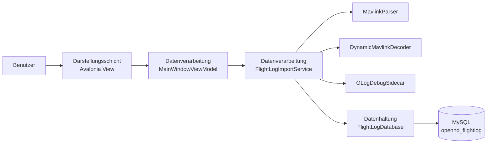
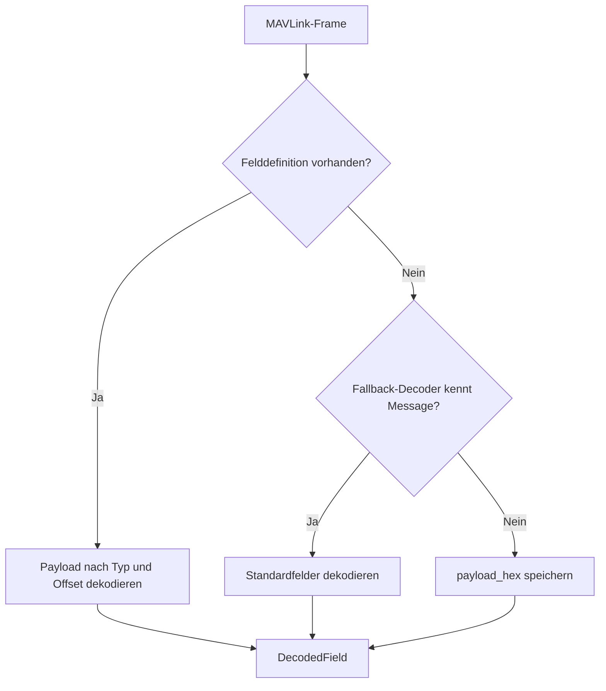
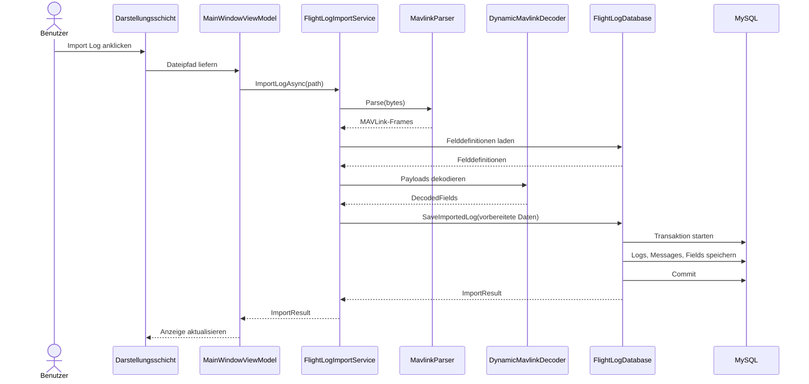
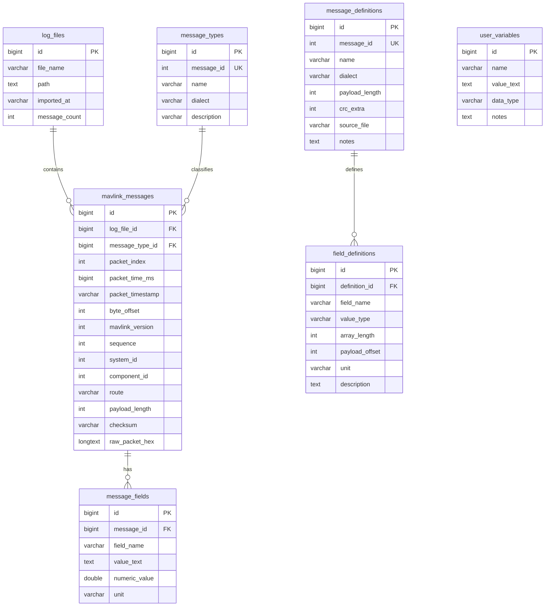

# OpenHD FlightLog Studio

## Dokumentation zur 3-Schichten-Architektur, Datenbank und Funktionsweise

**Projekt:** OpenHD FlightLog Studio  
**Technologie:** C# / .NET 9, Avalonia UI, MySQL, Docker  
**Architektur:** 3-Schichten-Architektur innerhalb einer Desktop-Anwendung  
**Zweck:** Import, Dekodierung, Speicherung und Anzeige von OpenHD-/MAVLink-Logdateien

---

## Inhaltsverzeichnis

1. Projektueberblick
2. Anforderung: 3-Schichten-Architektur
3. Umsetzung der drei Schichten im Projekt
4. Hauptfunktionen des Tools
5. Import- und Dekodierablauf
6. Datenbankmodell
7. Datenbankentscheidungen
8. Technologieentscheidungen
9. Fazit

## 1. Projektueberblick

OpenHD FlightLog Studio ist eine Desktop-Anwendung zum Analysieren von
OpenHD- und MAVLink-Logdateien. Solche Logdateien enthalten rohe binaere
MAVLink-Daten. Diese Daten sind fuer Menschen schwer direkt lesbar, weil sie
aus einzelnen Paketen, Headern, Payloads und Checksummen bestehen.

Das Tool importiert diese Dateien, erkennt MAVLink-v1- und MAVLink-v2-Frames,
dekodiert deren Inhalte und speichert die Ergebnisse in einer lokalen
MySQL-Datenbank. Danach koennen die Daten in der grafischen Oberflaeche in
Tabellen angezeigt, durchsucht und teilweise bearbeitet werden.

### Zentrale Ziele

- Rohdaten aus Logdateien in strukturierte Daten umwandeln.
- MAVLink-Nachrichten und Felder lesbar machen.
- Importierte Logs dauerhaft in einer relationalen Datenbank speichern.
- OpenHD-spezifische MAVLink-Definitionen verwenden.
- Import-, SQL- und Debug-Schritte nachvollziehbar anzeigen.
- Die Software nach dem Prinzip der 3-Schichten-Architektur strukturieren.

### Wichtige Projektdaten

| Punkt | Umsetzung |
| --- | --- |
| Anwendungstyp | Desktop-Anwendung |
| UI-Framework | Avalonia UI |
| Programmiersprache | C# |
| Plattform | .NET 9 |
| Datenbank | MySQL |
| Datenbankname | `openhd_flightlog` |
| Datenbankzugriff | `MySqlConnector` |
| Datenbankbereitstellung | lokal oder automatisch ueber Docker |
| Docker-Image | `mysql:8.4` |
| Docker-Container | `openhd-flightlog-mysql` |

### Unterstuetzte Eingabedateien

- `.oLog`
- `.olog`
- `.tlog`
- `.bin`
- `.log`
- `.mavlink`
- optionale `.debug.jsonl` Sidecar-Dateien fuer Replay-Zeitinformationen

## 2. Anforderung: 3-Schichten-Architektur

Die vorgegebene Architektur teilt die Software in drei Schichten:

1. **View oder Darstellungsschicht**
   - Implementiert die Benutzerschnittstelle.
   - Beispiel: GUI, Fenster, Buttons, Tabellen, Eingabefelder.

2. **Datenverarbeitungsschicht**
   - Bereitet Daten aus der Datenhaltungsschicht auf.
   - Verarbeitet, transformiert und prueft Daten.
   - Reicht Daten an die Darstellungsschicht weiter.

3. **Datenhaltungsschicht**
   - Speichert persistente Daten.
   - Das kann eine Datenbank, ein Dateisystem oder eine Web-API sein.

Wichtig ist: Eine 3-Schichten-Architektur bedeutet nicht zwingend, dass drei
separate Programme oder ein HTTP-Server existieren muessen. Die Schichten
beschreiben vor allem getrennte Verantwortlichkeiten.

In diesem Projekt sind alle drei Schichten innerhalb einer Desktop-Anwendung
umgesetzt. Die Trennung erfolgt ueber Projektdateien, Klassen und klare
Verantwortlichkeiten.

### Allgemeines Schichtenmodell

### Umsetzung im Projekt

| Schicht | Projektdateien | Aufgabe |
| --- | --- | --- |
| Darstellungsschicht | `MainWindow.axaml`, `MainWindow.axaml.cs` | GUI, Tabs, Buttons, Tabellen, Dateiauswahl |
| Datenverarbeitungsschicht | `MainWindowViewModel.cs`, `FlightLogImportService.cs`, Parser-/Decoder-Services | Importsteuerung, Datei lesen, Parsen, Dekodieren, Daten vorbereiten |
| Datenhaltungsschicht | `FlightLogDatabase.cs`, MySQL `openhd_flightlog` | Schema, SQL-Abfragen, Transaktionen, Speichern und Laden |

## 3. Umsetzung der drei Schichten im Projekt

### 3.1 Darstellungsschicht

Die Darstellungsschicht ist die grafische Oberflaeche. Sie wird mit Avalonia UI
umgesetzt.

Wichtige Dateien:

- `OpenHdFlightLog/Views/MainWindow.axaml`
- `OpenHdFlightLog/Views/MainWindow.axaml.cs`

`MainWindow.axaml` beschreibt das Layout der Anwendung. Dazu gehoeren:

- Hauptfenster
- Buttons wie `Import Log`, `Load OpenHD MAVLink`, `Refresh`
- Tabs wie `Flight Logs`, `Variables`, `MAVLink Definitions`, `Debug`
- DataGrids fuer Logs, Messages, Felder, Variablen und Debug-Ereignisse
- Statusleiste und Ladeanzeige

`MainWindow.axaml.cs` enthaelt nur UI-nahe Logik, zum Beispiel den nativen
Dateiauswahldialog. Die View selbst fuehrt keine SQL-Abfragen aus und dekodiert
keine MAVLink-Daten.

### 3.2 Datenverarbeitungsschicht

Die Datenverarbeitungsschicht enthaelt die fachliche Logik. Sie entscheidet,
was bei einem Import passiert, wie Logdateien verarbeitet werden und welche
Daten an die UI weitergegeben werden.

Wichtige Dateien:

- `OpenHdFlightLog/ViewModels/MainWindowViewModel.cs`
- `OpenHdFlightLog/Services/FlightLogImportService.cs`
- `OpenHdFlightLog/Services/MavlinkParser.cs`
- `OpenHdFlightLog/Services/DynamicMavlinkDecoder.cs`
- `OpenHdFlightLog/Services/MavlinkMessageDecoder.cs`
- `OpenHdFlightLog/Services/MavlinkDefinitionLoader.cs`
- `OpenHdFlightLog/Services/OLogDebugSidecar.cs`
- `OpenHdFlightLog/Services/OsdReplayService.cs`

Nach dem Architekturumbau liegt die Importlogik nicht mehr in der Datenbankklasse.
Stattdessen koordiniert `FlightLogImportService` den Import:

1. Datei lesen.
2. MAVLink-Frames parsen.
3. Felddefinitionen aus der Datenbank laden.
4. optionale Sidecar-Zeitdaten lesen.
5. Payloads dekodieren.
6. vorbereitete Importdaten an die Datenhaltungsschicht uebergeben.

Damit ist die Datenverarbeitungsschicht klar von der Datenhaltung getrennt.

### 3.3 Datenhaltungsschicht

Die Datenhaltungsschicht speichert und laedt Daten. Sie kennt SQL, Tabellen,
Transaktionen, Foreign Keys und Datenbankverbindungen.

Wichtige Dateien und Systeme:

- `OpenHdFlightLog/Services/FlightLogDatabase.cs`
- MySQL-Datenbank `openhd_flightlog`
- Docker-Container `openhd-flightlog-mysql`

`FlightLogDatabase` fuehrt keine MAVLink-Dekodierung mehr aus. Die Klasse
bekommt bereits vorbereitete Importdaten und speichert diese in einer
Transaktion. Dadurch entspricht sie besser der Rolle einer Datenhaltungsschicht.

### Aktuelle Architektur

## 4. Hauptfunktionen des Tools

### 4.1 Logdateien importieren

Der Nutzer waehlt ueber die grafische Oberflaeche eine Logdatei aus. Danach
startet die Datenverarbeitungsschicht den Import. Die Datei wird als Byte-Strom
gelesen und auf MAVLink-Pakete untersucht.

Das Tool erkennt:

- MAVLink v1 mit Startbyte `0xFE`
- MAVLink v2 mit Startbyte `0xFD`
- MAVLink-v2-Pakete mit optionaler Signaturlaenge

### 4.2 MAVLink-Frames parsen

`MavlinkParser` sucht im Byte-Strom nach gueltigen MAVLink-Frames. Fuer jeden
Frame werden technische Informationen extrahiert:

- Paketindex
- Byte-Offset in der Datei
- MAVLink-Version
- Sequence
- System-ID
- Component-ID
- Message-ID
- Payload
- Checksumme
- Rohpaket als Bytes

### 4.3 OpenHD-Definitionen laden

OpenHD verwendet eigene MAVLink-Nachrichten. Damit diese nicht nur als rohe
Payloads erscheinen, kann das Tool OpenHD-MAVLink-Header lesen. Daraus werden
Message-Definitionen und Felddefinitionen erstellt.

Diese Definitionen werden in der Datenbank gespeichert:

- Message-ID
- Name der Message
- Dialekt
- Payload-Laenge
- CRC Extra
- Feldname
- Feldtyp
- Payload-Offset
- Einheit und Beschreibung

### 4.4 Payloads dekodieren

`DynamicMavlinkDecoder` verwendet die gespeicherten Felddefinitionen. Fuer jedes
Feld wird anhand von Typ und Offset ein Wert aus dem Payload gelesen.

Wenn keine Definition existiert, nutzt das Tool einen Fallback-Decoder fuer
einige bekannte Standard-MAVLink-Nachrichten. Wenn auch das nicht moeglich ist,
wird die Payload als Hex-Wert gespeichert. Dadurch gehen unbekannte Nachrichten
nicht verloren.

### 4.5 Daten anzeigen und bearbeiten

Die UI zeigt die Daten in mehreren Tabs:

- importierte Logs
- MAVLink-Frames
- dekodierte Felder
- automatische Logvariablen
- manuelle Variablen und Notizen
- MAVLink-Definitionen
- Debug-Ereignisse

Einige Daten koennen gespeichert oder geloescht werden, zum Beispiel manuelle
Variablen, Felder und Definitionen.

### Dekodierlogik

## 5. Import- und Dekodierablauf

Der Import ist der wichtigste Ablauf des Programms. Er zeigt besonders gut, wie
die drei Schichten zusammenarbeiten.

### Ablauf in Worten

1. Der Benutzer klickt in der View auf `Import Log`.
2. Die View oeffnet den Dateiauswahldialog.
3. Die View gibt den Dateipfad an das ViewModel weiter.
4. Das ViewModel startet den `FlightLogImportService`.
5. Der Import-Service liest die Datei.
6. `MavlinkParser` extrahiert MAVLink-Frames.
7. Der Import-Service laedt Felddefinitionen aus der Datenbank.
8. `OLogDebugSidecar` liest optionale Zeitdaten.
9. `DynamicMavlinkDecoder` dekodiert die Payloads.
10. Der Import-Service uebergibt vorbereitete Importdaten an `FlightLogDatabase`.
11. `FlightLogDatabase` speichert alles in einer MySQL-Transaktion.
12. Das ViewModel aktualisiert die ObservableCollections.
13. Die Avalonia-DataGrids aktualisieren sich automatisch.

### Import als Sequenzdiagramm

### Warum eine Transaktion?

Der Import schreibt viele zusammenhaengende Datensaetze:

- eine Logdatei
- viele MAVLink-Messages
- viele dekodierte Felder
- Message-Typen

Diese Daten gehoeren zusammen. Deshalb werden sie in einer Transaktion
gespeichert. Wenn ein Fehler passiert, wird der Import nicht halb gespeichert.
Das verhindert unvollstaendige oder widerspruechliche Daten.

## 6. Datenbankmodell

Die Datenbank ist ein zentraler Teil des Projekts. Sie speichert importierte
Logs, erkannte MAVLink-Nachrichten, dekodierte Felder, manuelle Variablen und
MAVLink-Definitionen.

### Vereinfachtes ER-Diagramm

### Tabellenuebersicht

| Tabelle | Zweck |
| --- | --- |
| `log_files` | Ein Datensatz pro importierter Logdatei |
| `message_types` | Normalisierte MAVLink-Message-Typen |
| `mavlink_messages` | Ein Datensatz pro erkanntem MAVLink-Frame |
| `message_fields` | Dekodierte Felder einer Message |
| `user_variables` | Manuelle Variablen und Notizen |
| `message_definitions` | MAVLink-Message-Definitionen aus OpenHD-Headern |
| `field_definitions` | Feldlayout einer Message-Definition |

### Vorhandenes gerendertes Datenbankbild

Falls die Dokumentation als Markdown angezeigt wird, kann das vorhandene
gerenderte ER-Diagramm ebenfalls eingeblendet werden:

Hinweis: Das Mermaid-Diagramm oben beschreibt die aktuelle MySQL-Struktur in
vereinfachter Form. Das SVG-Bild dient als visuelle Hilfe fuer die Beziehungen.

## 7. Datenbankentscheidungen

### 7.1 MySQL als relationale Datenbank

MySQL passt gut zum Projekt, weil die Daten stark strukturiert sind. Ein Log
enthaelt viele Messages, eine Message enthaelt viele Felder, und Definitionen
enthalten viele Felddefinitionen. Diese Beziehungen lassen sich gut mit
Primary Keys, Foreign Keys und Joins modellieren.

### 7.2 Foreign Keys und Cascade Delete

Die Datenbank nutzt Foreign Keys, um Beziehungen zwischen Tabellen abzusichern.
Beispiel:

- `mavlink_messages.log_file_id` verweist auf `log_files.id`
- `message_fields.message_id` verweist auf `mavlink_messages.id`
- `field_definitions.definition_id` verweist auf `message_definitions.id`

Wenn ein Log geloescht wird, entfernt MySQL automatisch die zugehoerigen
Messages und Felder. Das passiert ueber `ON DELETE CASCADE`. Dadurch bleiben
keine verwaisten Detaildaten in der Datenbank.

### 7.3 Transaktionen

Beim Import werden viele Datensaetze geschrieben. Eine Transaktion sorgt dafuer,
dass der Import als Einheit behandelt wird.

Vorteil:

- Entweder wird der komplette Import gespeichert.
- Oder bei einem Fehler wird nichts davon dauerhaft gespeichert.

Das ist wichtig fuer Datenkonsistenz.

### 7.4 Indizes

Die Datenbank legt Indizes auf haeufig verwendeten Spalten an, zum Beispiel:

- `mavlink_messages.log_file_id`
- `mavlink_messages.message_type_id`
- `message_fields.message_id`
- `message_fields.field_name`
- `field_definitions.definition_id`

Diese Indizes beschleunigen typische UI-Abfragen, zum Beispiel:

- alle Messages zu einem Log laden
- alle Felder zu einer Message laden
- alle Felddefinitionen zu einer Definition laden

### 7.5 Speicherung von Rohdaten

Jede MAVLink-Message speichert das komplette Rohpaket als Hex-String in
`raw_packet_hex`. Das vergroessert zwar die Datenbank, hat aber Vorteile:

- Der Import bleibt nachvollziehbar.
- Dekodierte Werte koennen spaeter mit dem Originalpaket verglichen werden.
- Debugging ist einfacher.

## 8. Technologieentscheidungen

### 8.1 Warum Avalonia statt WinForms?

WinForms ist eine klassische Windows-Technologie. Sie ist fuer einfache
Windows-Formulare geeignet, aber stark an Windows gebunden.

Avalonia wurde gewaehlt, weil:

- es plattformuebergreifend funktioniert: Windows, Linux und macOS
- es moderne XAML-aehnliche UI-Dateien verwendet
- es gut mit MVVM und Data Binding zusammenpasst
- DataGrids, Tabs und Statusanzeigen gut umsetzbar sind
- die View sauber vom ViewModel getrennt werden kann

Fuer dieses Projekt ist die UI nicht nur ein einfaches Formular. Sie zeigt viele
Tabellen, Statusinformationen und verschiedene Ansichten. Avalonia passt daher
besser zur gewuenschten Schichtenarchitektur.

### 8.2 Warum Dockerized MySQL statt XAMPP?

XAMPP enthaelt typischerweise Apache, PHP, MariaDB/MySQL und weitere Werkzeuge.
Das ist sinnvoll fuer PHP-Webprojekte, aber dieses Projekt ist eine
C#-Desktop-Anwendung.

Das Projekt braucht nur eine relationale Datenbank. Deshalb ist Docker mit
MySQL gezielter.

Vorteile von Docker:

- reproduzierbare MySQL-Umgebung
- definierter Containername
- definierte MySQL-Version
- keine manuelle XAMPP-Konfiguration
- keine Vermischung mit anderen lokalen Diensten
- einfacher fuer Vorfuehrungen auf anderen Rechnern

Wenn kein MySQL-Server erreichbar ist, versucht die Anwendung automatisch, den
Container `openhd-flightlog-mysql` mit dem Image `mysql:8.4` zu starten oder
anzulegen.

### 8.3 Warum kein HTTP-/Web-App-Ansatz?

Eine Web-App waere sinnvoll, wenn mehrere Benutzer gleichzeitig ueber ein
Netzwerk auf die Daten zugreifen sollen. Dieses Projekt ist aber ein lokales
Analysewerkzeug fuer Logdateien.

Vorteile der Desktop-App:

- direkter Zugriff auf lokale Dateien
- nativer Dateiauswahldialog
- kein Browser notwendig
- kein REST-API-Server notwendig
- weniger Infrastruktur
- einfacherer Ablauf fuer lokale Analyse und Schulvorfuehrung

Trotzdem ist die Architektur geschichtet. Die 3-Schichten-Architektur beschreibt
die Verantwortlichkeiten, nicht zwingend einen HTTP-Server.

## 9. Fazit

OpenHD FlightLog Studio setzt die geforderte 3-Schichten-Architektur innerhalb
einer Desktop-Anwendung um.

### Zusammenfassung der Schichten

| Schicht | Umsetzung |
| --- | --- |
| Darstellungsschicht | Avalonia Views: `MainWindow.axaml`, `MainWindow.axaml.cs` |
| Datenverarbeitungsschicht | ViewModel, `FlightLogImportService`, Parser, Decoder, OSD-Service |
| Datenhaltungsschicht | `FlightLogDatabase` und MySQL |

Der aktuelle Code ist so aufgebaut, dass die Datenbankklasse nicht mehr selbst
parst oder dekodiert. Diese Aufgaben liegen in der Datenverarbeitungsschicht.
Die Datenhaltungsschicht speichert vorbereitete Daten, fuehrt SQL-Abfragen aus
und sichert Konsistenz mit Transaktionen und Foreign Keys.

### Wichtigste Staerken

- klare Trennung zwischen UI, Verarbeitung und Speicherung
- persistente Speicherung in MySQL
- Import in Transaktionen
- Foreign Keys und Cascade Delete
- flexible MAVLink-Dekodierung durch gespeicherte Definitionen
- Docker-basierte Datenbankbereitstellung
- moderne Desktop-Oberflaeche mit Avalonia

### Moegliche Pruefungsantwort

Wenn gefragt wird, ob das Projekt wirklich der 3-Schichten-Architektur folgt,
kann man antworten:

> Ja. Die Darstellungsschicht ist die Avalonia-Oberflaeche. Die
> Datenverarbeitungsschicht besteht aus ViewModel, Import-Service, Parser und
> Decodern. Die Datenhaltungsschicht besteht aus `FlightLogDatabase` und der
> MySQL-Datenbank. Die Schichten laufen innerhalb einer Desktop-Anwendung, sind
> aber nach Verantwortlichkeiten getrennt.

