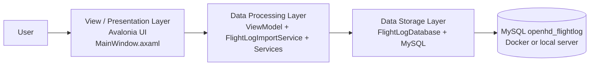
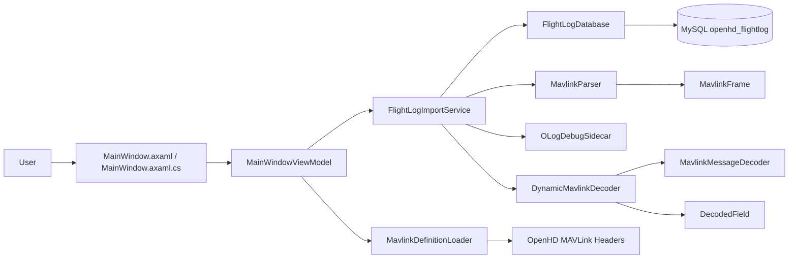
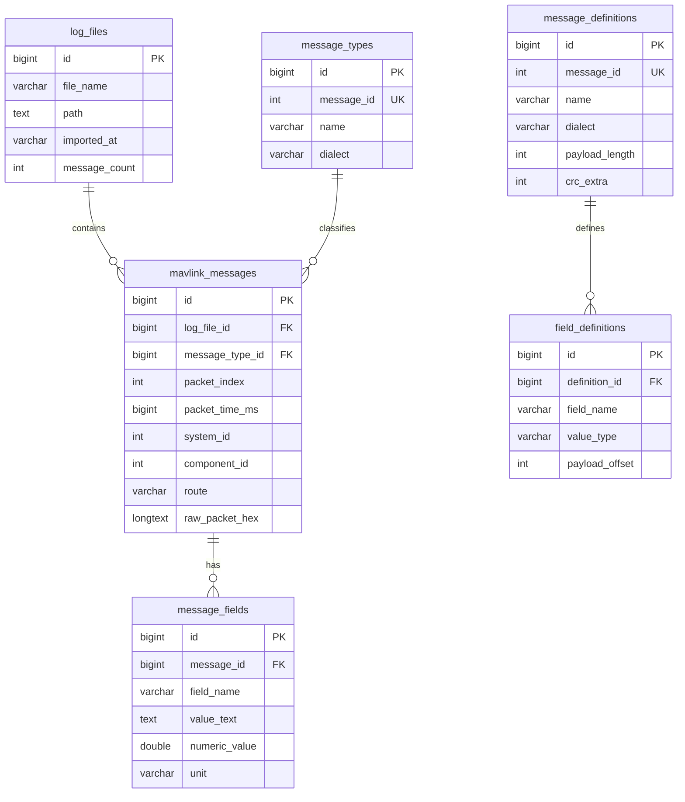
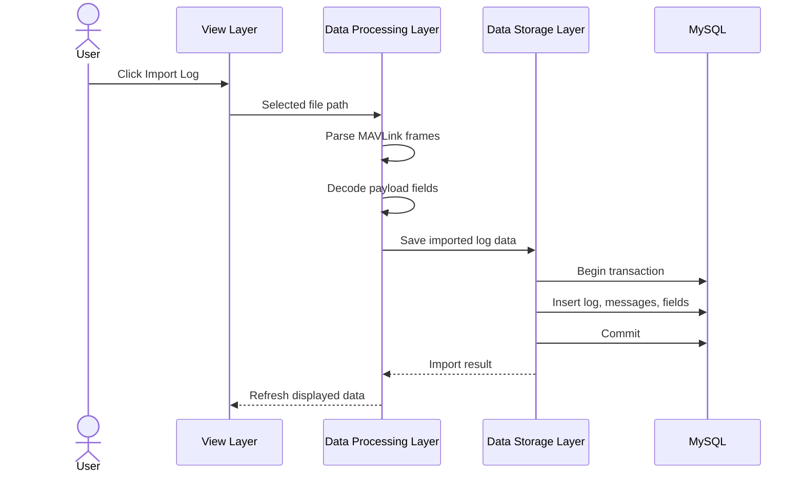

# Presentation Generation Prompt

Use this prompt in a presentation generation AI app to create slides about the
project.

---

Create a clear school presentation about the software project **OpenHD
FlightLog Studio**. The presentation must be structured around the required
**3-layer architecture**:

1. **View / presentation layer**
2. **Data processing layer**
3. **Data storage layer**

The presentation should explain how the project follows this architecture, then
focus on the **database**, the **main program functions**, and the **technical
decisions**: why we chose **Avalonia** instead of WinForms, and why we chose
**Dockerized MySQL** instead of XAMPP or an HTTP/web-app approach.

Target audience: teacher and classmates in a software/database class.

Tone: professional, simple, technically correct, suitable for a 7-10 minute
presentation.

Language: English.

Format: about 12-14 slides, with short bullet points and speaker notes.

Design style: dark technical dashboard style, inspired by flight telemetry,
logs, database tables, and MAVLink packets. Use diagrams where useful.

## Important Project Facts

- Project name: **OpenHD FlightLog Studio**
- Application type: desktop application
- UI framework: **Avalonia UI**
- Language/platform: **C# / .NET 9**
- Architecture: **3-layer architecture inside one desktop application**
- Database: local **MySQL** database named `openhd_flightlog`
- Database access library: `MySqlConnector`
- Automatic database startup: app checks if MySQL is reachable and can start a
  Docker container named `openhd-flightlog-mysql` with image `mysql:8.4`
- Main purpose: import, decode, store, and inspect OpenHD/MAVLink flight log
  files
- Supported input files: `.oLog`, `.olog`, `.tlog`, `.bin`, `.log`,
  `.mavlink`
- Optional sidecar files: `.debug.jsonl` for replay timing information

## Required 3-Layer Mapping

The teacher's rule:

- **View / presentation layer:** implements the user interface, for example a
  GUI.
- **Data processing layer:** prepares, processes, transforms, and forwards data
  between presentation and storage.
- **Data storage layer:** stores persistent data, often in a database, file
  system, or web API.

Map the project exactly like this:

| Required layer | Project implementation | Main responsibility |
| --- | --- | --- |
| View / presentation layer | `MainWindow.axaml`, `MainWindow.axaml.cs` | GUI, tabs, buttons, tables, file picker |
| Data processing layer | `MainWindowViewModel.cs`, `FlightLogImportService.cs`, parser/decoder/loader services | Import control, parsing, decoding, data preparation |
| Data storage layer | `FlightLogDatabase.cs` and MySQL `openhd_flightlog` | Schema, SQL queries, transactions, persistent storage |

Important wording:

- The project **does follow the 3-layer architecture by responsibility**.
- It is **not a web app** and does **not need a separate HTTP backend**.
- The data processing layer runs inside the desktop app as ViewModel and service
  classes.
- The UI does not contain SQL logic.
- The database layer is separated into `FlightLogDatabase.cs` and MySQL.

## Main Architecture Diagram

Use this diagram:

Speaker explanation:

- The user interacts only with the presentation layer.
- The presentation layer sends commands and selections to the data processing
  layer.
- The data processing layer parses logs, decodes MAVLink frames, prepares data,
  and calls storage functions.
- The data storage layer persists the result in MySQL and returns records back
  to the processing layer.

## Detailed Architecture Diagram

Use this diagram if a more technical architecture slide is useful:

## Slide Outline

### Slide 1 - Title

Title: **OpenHD FlightLog Studio**

Subtitle: **A 3-layer desktop tool for importing, decoding, and storing MAVLink
flight logs**

Speaker notes:

- Introduce the project as a desktop tool for analyzing OpenHD flight logs.
- State early that the presentation focuses on the 3-layer architecture and the
  database.

### Slide 2 - Project Goal

Bullets:

- OpenHD log files contain raw MAVLink packet data.
- Raw binary logs are hard to inspect manually.
- The tool converts logs into readable tables.
- Imported data is stored permanently in MySQL.
- Users can inspect logs, messages, fields, variables, definitions, and debug
  events.

Speaker notes:

- The tool turns raw telemetry into structured, searchable, readable data.
- The database is important because imported logs remain available after restart.

### Slide 3 - Required 3-Layer Architecture

Bullets:

- View / presentation layer: user interface.
- Data processing layer: prepares and transforms data.
- Data storage layer: stores persistent data.
- Our project implements all three layers inside one desktop application.

Use this diagram:

Speaker notes:

- A 3-layer architecture does not automatically mean three separate programs.
- The key requirement is separation of responsibilities.

### Slide 4 - Our 3 Layers in Code

Bullets:

- View layer: `MainWindow.axaml`, `MainWindow.axaml.cs`.
- Data processing layer: `MainWindowViewModel.cs`, `FlightLogImportService.cs`.
- Data processing layer: `MavlinkParser`, `DynamicMavlinkDecoder`,
  `MavlinkDefinitionLoader`, `OLogDebugSidecar`.
- Data storage layer: `FlightLogDatabase.cs`.
- Physical storage: MySQL database `openhd_flightlog`.

Speaker notes:

- The UI does not directly write SQL.
- The ViewModel and services process data before it is shown or stored.
- The database layer handles schema, queries, transactions, and persistence.

### Slide 5 - View / Presentation Layer

Bullets:

- Built with Avalonia UI.
- Main file: `MainWindow.axaml`.
- Shows tabs, buttons, status text, progress bar, and DataGrids.
- Code-behind file: `MainWindow.axaml.cs`.
- Handles Avalonia-specific file picker logic.
- Sends selected file paths and UI actions to the ViewModel.

Speaker notes:

- This layer implements the graphical user interface.
- It should stay focused on display and user interaction, not database logic.

### Slide 6 - Data Processing Layer

Bullets:

- Main files: `MainWindowViewModel.cs`, `FlightLogImportService.cs`.
- Controls commands such as import, refresh, save, delete.
- Runs the import workflow outside the database class.
- Keeps selected logs, messages, fields, definitions, and status.
- Uses services to parse and decode data.
- Prepares data for Avalonia DataGrids through observable collections.

Speaker notes:

- This is the middle layer from the teacher's definition.
- It takes data from storage, prepares it, and forwards it to the view.
- It also takes user actions from the view and decides what should happen.

### Slide 7 - Processing Services

Bullets:

- `MavlinkParser`: extracts MAVLink v1/v2 frames from binary files.
- `FlightLogImportService`: coordinates reading, parsing, decoding, and saving.
- `DynamicMavlinkDecoder`: decodes payloads using stored field definitions.
- `MavlinkMessageDecoder`: fallback decoder for known standard messages.
- `MavlinkDefinitionLoader`: reads OpenHD MAVLink header definitions.
- `OLogDebugSidecar`: reads optional replay timing from `.debug.jsonl`.

Speaker notes:

- These services are part of the data processing layer.
- They transform raw files and binary packets into structured records.

### Slide 8 - Data Storage Layer

Bullets:

- Main class: `FlightLogDatabase.cs`.
- Physical database: MySQL `openhd_flightlog`.
- Creates database and tables if missing.
- Runs SQL queries and joins.
- Uses foreign keys and indexes.
- Uses transactions during import.
- Receives already prepared import records from the processing layer.
- Can start MySQL through Docker if no server is reachable.

Speaker notes:

- This layer is responsible for persistence.
- `FlightLogDatabase` is the database access class, while MySQL is the actual
  storage system.

### Slide 9 - Database Tables

Show this simplified ER diagram:

Speaker notes:

- `log_files` is the root table for imported logs.
- `mavlink_messages` stores each detected MAVLink frame.
- `message_fields` stores decoded field values.
- `message_definitions` and `field_definitions` define how payloads are decoded.
- `message_types` avoids repeating the same message type data for every packet.

### Slide 10 - Database Design Decisions

Bullets:

- Foreign keys keep relationships valid.
- `ON DELETE CASCADE` removes child data automatically.
- Import runs inside a transaction.
- Indexes speed up common UI queries.
- `raw_packet_hex` preserves original packet data.
- `value_text` stores every value, `numeric_value` supports numeric values.

Speaker notes:

- A log import should fully succeed or not be saved.
- Cascade deletes prevent orphaned messages and fields.
- Raw packet storage helps debugging and traceability.

### Slide 11 - Import Function Flow Across the 3 Layers

Use this diagram:

Speaker notes:

- This slide directly proves the 3-layer flow.
- UI starts the action, processing transforms the data, storage persists it.

### Slide 12 - Why Avalonia Instead of WinForms

Bullets:

- Avalonia works cross-platform: Windows, Linux, and macOS.
- WinForms is mainly Windows-focused.
- Avalonia supports MVVM and data binding well.
- The UI needs tabs, DataGrids, progress state, and live updates.
- XAML layout keeps UI structure separate from logic.

Speaker notes:

- The project is a data inspection tool, not just a simple form.
- Avalonia fits the layered structure because the View can bind cleanly to the
  ViewModel.

### Slide 13 - Why Dockerized MySQL Instead of XAMPP

Bullets:

- Docker gives a reproducible MySQL environment.
- The app can start the expected MySQL container automatically.
- No manual XAMPP setup is required.
- The project only needs MySQL, not Apache or PHP.
- Docker avoids mixing the project database with unrelated local services.
- Same setup can be used on different machines.

Speaker notes:

- XAMPP is useful for PHP/web projects.
- This project is a C# desktop app, so Dockerized MySQL is more focused and
  predictable.

### Slide 14 - Why Not an HTTP/Web App

Bullets:

- The tool works directly with local log files.
- A desktop file picker is natural for this workflow.
- No browser/server deployment is required.
- Less complexity: no REST API, routing, authentication, or hosting.
- The project still follows the 3-layer model internally.

Speaker notes:

- A web app would make sense for multi-user access or remote sharing.
- For local log analysis, a desktop app is simpler and more direct.
- 3-layer architecture describes responsibilities, not necessarily HTTP.

### Slide 15 - Summary

Bullets:

- OpenHD FlightLog Studio follows the required 3-layer architecture.
- View layer: Avalonia UI.
- Data processing layer: ViewModel, import service, parser, decoder, definition loader.
- Data storage layer: `FlightLogDatabase` and MySQL.
- Docker makes the database setup repeatable.
- The strongest points are clear separation, persistence, transactions, and
  flexible MAVLink decoding.

Speaker notes:

- End by emphasizing that the database is central to the tool.
- The project demonstrates UI binding, data processing, SQL schema design, and
  containerized infrastructure.

## Optional Final Slide - Possible Teacher Questions

Question: Does the project really use 3 layers?
Answer: Yes. The View layer is Avalonia, the data processing layer is the
ViewModel plus services, and the data storage layer is `FlightLogDatabase` plus
MySQL.

Question: Does 3-layer architecture require a web server?
Answer: No. The three layers describe responsibilities. They can be implemented
inside a desktop app.

Question: Why does the app use MVVM?
Answer: MVVM separates the UI layout from state, commands, and processing logic.
The View binds to data, while the ViewModel controls actions and talks to
services.

Question: Why use MySQL?
Answer: It gives a real relational database with foreign keys, transactions,
indexes, and SQL joins, which fits the database focus of the project.

Question: Why Docker?
Answer: Docker provides a predictable MySQL setup without manual XAMPP
configuration.

Question: Is there a backend?
Answer: Yes, as an internal data processing layer inside the desktop app. It is
not a separate HTTP backend.

Question: How is data consistency protected?
Answer: Imports use transactions and the schema uses foreign keys with cascade
delete.

Question: What happens if a MAVLink message is unknown?
Answer: The app still stores the message and saves the payload as hex, so the
data is not lost.

## Extra Requirements for the Generated Presentation

- Use the exact 3-layer terms:
  - View / presentation layer
  - Data processing layer
  - Data storage layer
- Include at least one slide that maps project files to these three layers.
- Include at least one database ER diagram.
- Keep slide text short.
- Put deeper explanations in speaker notes.
- Avoid saying SQLite. The current implementation uses MySQL.
- Avoid presenting the app as a web app.
- Avoid claiming there is a separate HTTP backend.
- Say clearly that the project is a desktop app with internal 3-layer
  separation.
