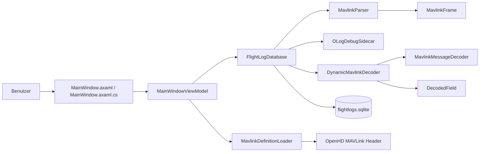
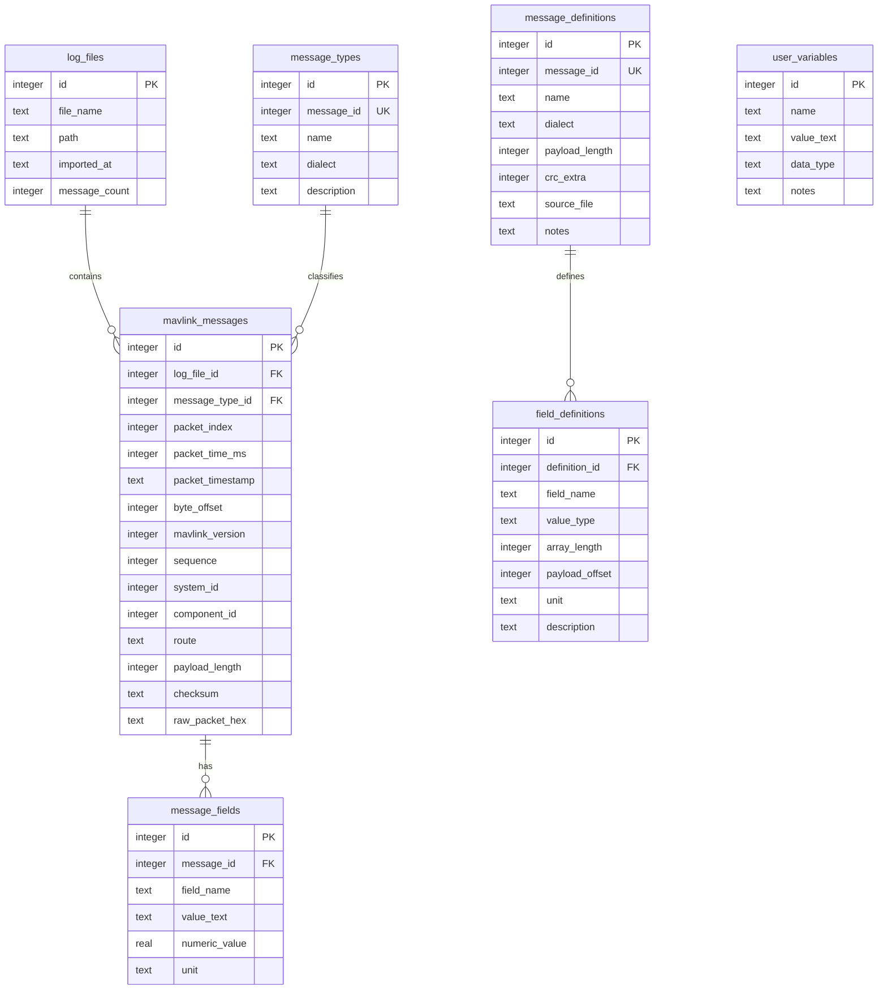
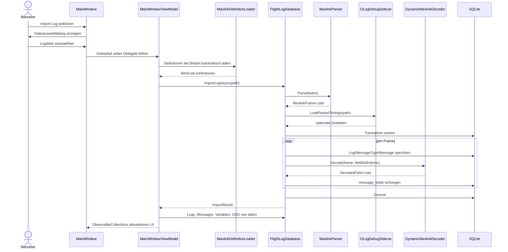
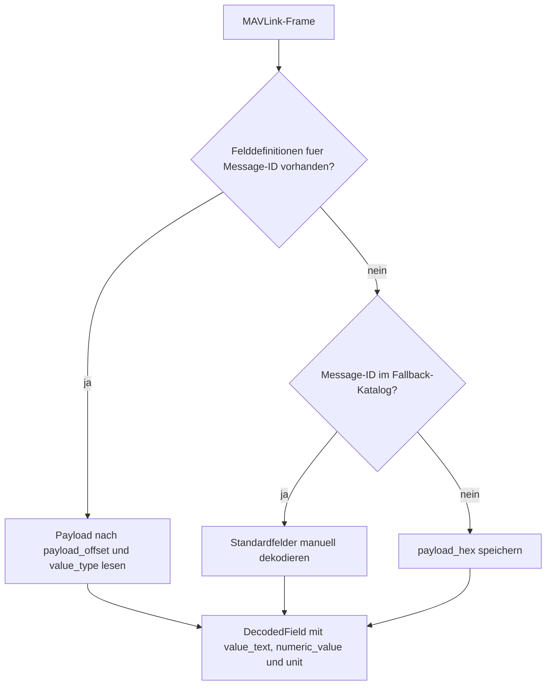

# Pruefungsdokumentation

Dieses Dokument fasst OpenHD FlightLog Studio so zusammen, dass Architektur,
Klassen, Datenmodell und zentrale Programmablaeufe in einer Pruefungssituation
schnell erklaert werden koennen.

## Projektsteckbrief

| Punkt | Beschreibung |
| --- | --- |
| Name | OpenHD FlightLog Studio |
| Zweck | Import, Dekodierung, Speicherung und Anzeige von OpenHD-/MAVLink-Logdateien |
| Anwendungstyp | Desktop-Anwendung mit Avalonia UI |
| Architektur | MVVM mit separater Service- und Model-Schicht |
| Sprache / Plattform | C# auf .NET 9 |
| Persistenz | Lokale SQLite-Datenbank mit `Microsoft.Data.Sqlite` |
| Externe Eingaben | Logdateien (`.oLog`, `.tlog`, `.bin`, `.log`, `.mavlink`) und optionale `.debug.jsonl` Sidecars |
| Zentrale Ausgabe | Tabellenansichten fuer Logs, MAVLink-Nachrichten, dekodierte Felder, Variablen, OSD-Replay und Debug-Ereignisse |

## Fachliches Ziel

Die Anwendung soll rohe MAVLink-Daten aus OpenHD-Logs nachvollziehbar machen.
Statt nur einen Byte-Strom zu speichern, werden Pakete erkannt, in Felder
dekodiert, in einer lokalen Datenbank abgelegt und ueber mehrere UI-Tabs
auswertbar gemacht.

Wichtige fachliche Funktionen:

- MAVLink-v1- und MAVLink-v2-Frames aus binaeren Logdateien erkennen.
- OpenHD-spezifische MAVLink-Definitionen aus generierten Headerdateien laden.
- Payloads dynamisch anhand gespeicherter Felddefinitionen dekodieren.
- Ohne passende Definitionen auf einen eingebauten MAVLink-Standarddecoder
  zurueckfallen.
- Importierte Logs, Nachrichten, Felder, Definitionen und manuelle Variablen
  dauerhaft in SQLite speichern.
- Aus bekannten OpenHD-Feldern eine OSD-Replay-Ansicht berechnen.
- Debug-Ereignisse anzeigen, damit Import- und SQL-Schritte nachvollziehbar sind.

## Architekturuebersicht



Die UI-Schicht kennt Avalonia-Controls und Dateidialoge. Das ViewModel enthaelt
den UI-Zustand, Commands und Auswahlreaktionen. Die Service-Schicht verarbeitet
Dateien, Datenbankzugriffe, Parser und Decoder. Die Model-Schicht besteht aus
einfachen Datenobjekten fuer UI und Persistenz.

## Klassendiagramm

```mermaid
classDiagram
    class Program {
        +Main(string[] args) void
        +BuildAvaloniaApp() AppBuilder
    }

    class App
    class ViewLocator
    class MainWindow {
        +MainWindow()
        -PickLogFileAsync() Task
    }

    class ViewModelBase
    class MainWindowViewModel {
        -FlightLogDatabase database
        +ObservableCollection~LogFileRecord~ Logs
        +ObservableCollection~MavlinkMessageRecord~ Messages
        +ObservableCollection~MessageFieldRecord~ Fields
        +ObservableCollection~LogVariableRecord~ LogVariables
        +ObservableCollection~OsdReplayRecord~ OsdReplayFrames
        +ObservableCollection~UserVariableRecord~ Variables
        +ObservableCollection~MavlinkMessageDefinitionRecord~ Definitions
        +ObservableCollection~MavlinkFieldDefinitionRecord~ DefinitionFields
        +ObservableCollection~DebugEventRecord~ DebugEvents
        +OpenLogFileRequested
        +string Status
        +bool IsBusy
        +ImportLogAsync() Task
        +LoadOpenHdDefinitions() void
        +DeleteLog() void
        +SaveField() void
        +AddVariable() void
        +SaveVariable() void
        +SaveDefinition() void
        +PreviousOsdFrame() void
        +NextOsdFrame() void
        +RefreshAll() void
    }

    class FlightLogDatabase {
        +string DatabasePath
        +EnsureSchema() void
        +ImportLogAsync(string path) Task~ImportResult~
        +ImportDefinitions(IReadOnlyList~LoadedMavlinkDefinition~ definitions) int
        +GetLogs() IReadOnlyList~LogFileRecord~
        +GetMessages(long logId) IReadOnlyList~MavlinkMessageRecord~
        +GetFields(long messageId) IReadOnlyList~MessageFieldRecord~
        +GetLogVariables(long logId) IReadOnlyList~LogVariableRecord~
        +GetOsdReplayFrames(long logId) IReadOnlyList~OsdReplayRecord~
        +GetVariables() IReadOnlyList~UserVariableRecord~
        +GetDefinitions() IReadOnlyList~MavlinkMessageDefinitionRecord~
        +SaveField(MessageFieldRecord field) void
        +SaveVariable(UserVariableRecord variable) long
        +DeleteLog(long logId) void
    }

    class MavlinkParser {
        +Parse(byte[] bytes) IReadOnlyList~MavlinkFrame~
    }

    class DynamicMavlinkDecoder {
        +Decode(MavlinkFrame frame, IReadOnlyList~MavlinkFieldDefinitionRecord~ fields) IReadOnlyList~DecodedField~
    }

    class MavlinkMessageDecoder {
        +GetMessageName(int messageId) string
        +Decode(MavlinkFrame frame) IReadOnlyList~DecodedField~
    }

    class MavlinkDefinitionLoader {
        +DefaultOpenHdRoot string
        +DefaultHeaderRoot string
        +LoadFromOpenHdHeaders(string? repositoryRoot) IReadOnlyList~LoadedMavlinkDefinition~
    }

    class OLogDebugSidecar {
        +LoadPacketTimings(string logPath) IReadOnlyDictionary~int, PacketTiming~
    }

    class LogFileRecord
    class MavlinkMessageRecord
    class MessageFieldRecord
    class LogVariableRecord
    class OsdReplayRecord
    class UserVariableRecord
    class MavlinkMessageDefinitionRecord
    class MavlinkFieldDefinitionRecord
    class DebugEventRecord
    class MavlinkFrame
    class DecodedField
    class LoadedMavlinkDefinition
    class PacketTiming
    class ImportResult

    Program --> App
    MainWindow --> MainWindowViewModel : DataContext / Delegate
    MainWindowViewModel --|> ViewModelBase
    MainWindowViewModel *-- FlightLogDatabase
    MainWindowViewModel --> MavlinkDefinitionLoader
    MainWindowViewModel --> LogFileRecord
    MainWindowViewModel --> MavlinkMessageRecord
    MainWindowViewModel --> MessageFieldRecord
    MainWindowViewModel --> UserVariableRecord
    MainWindowViewModel --> MavlinkMessageDefinitionRecord
    MainWindowViewModel --> MavlinkFieldDefinitionRecord
    MainWindowViewModel --> OsdReplayRecord
    MainWindowViewModel --> DebugEventRecord
    FlightLogDatabase --> MavlinkParser
    FlightLogDatabase --> DynamicMavlinkDecoder
    FlightLogDatabase --> OLogDebugSidecar
    FlightLogDatabase --> ImportResult
    MavlinkParser --> MavlinkFrame
    DynamicMavlinkDecoder --> MavlinkFrame
    DynamicMavlinkDecoder --> DecodedField
    DynamicMavlinkDecoder --> MavlinkMessageDecoder : fallback
    MavlinkDefinitionLoader --> LoadedMavlinkDefinition
    LoadedMavlinkDefinition --> MavlinkMessageDefinitionRecord
    LoadedMavlinkDefinition --> MavlinkFieldDefinitionRecord
    OLogDebugSidecar --> PacketTiming
```



## Datenmodell / ER-Diagramm



`user_variables` ist bewusst unabhaengig von importierten Logs. Dadurch bleiben
manuelle Notizen erhalten, auch wenn ein Log geloescht wird. Logs, Messages und
Message-Felder sind dagegen ueber `ON DELETE CASCADE` verbunden.

## Import-Ablauf



## Dekodierlogik



Der dynamische Decoder ist der normale Weg fuer OpenHD-Nachrichten. Der
Fallback-Decoder verhindert, dass unbekannte oder nicht definierte Nachrichten
komplett verloren gehen.

## Wichtige Klassen und Verantwortlichkeiten

| Klasse | Verantwortlichkeit |
| --- | --- |
| `Program` | Startpunkt und Avalonia-Konfiguration |
| `MainWindow` | Avalonia-Fenster, Dateiauswahl, Verbindung zwischen UI und ViewModel |
| `MainWindowViewModel` | UI-Zustand, Commands, Auswahlreaktionen, Importsteuerung |
| `FlightLogDatabase` | SQLite-Schema, Transaktionen, CRUD-Methoden, Importpersistenz |
| `MavlinkParser` | Byte-Strom nach MAVLink-v1/v2-Frames durchsuchen |
| `DynamicMavlinkDecoder` | Payloads anhand gespeicherter Felddefinitionen dekodieren |
| `MavlinkMessageDecoder` | Fallback fuer bekannte Standard-MAVLink-Nachrichten |
| `MavlinkDefinitionLoader` | OpenHD-Headerdateien lesen und Message-/Felddefinitionen extrahieren |
| `OLogDebugSidecar` | Optionale Zeitdaten aus `.debug.jsonl` Sidecar-Dateien lesen |
| `Models/*Record` | Datenobjekte fuer UI-Bindings und Datenbankwerte |

## Architekturentscheidungen

| Entscheidung | Begruendung |
| --- | --- |
| Avalonia statt reiner Konsolenanwendung | Plattformuebergreifende Desktop-UI mit DataGrid- und Tab-Ansichten |
| MVVM | UI-Layout, UI-Zustand und Datenlogik bleiben getrennt |
| SQLite-Datei im Benutzerprofil | Keine Serverinstallation noetig, Daten bleiben zwischen Programmstarts erhalten |
| Import in Transaktion | Ein Log wird vollstaendig oder gar nicht gespeichert |
| Definitionen in DB speichern | Dekodierung wird nachvollziehbar und Definitionen koennen in der UI angezeigt/bearbeitet werden |
| Dynamischer Decoder plus Fallback | OpenHD-spezifische Felder werden genau dekodiert, unbekannte Nachrichten bleiben trotzdem sichtbar |
| Debug-Tab | Import- und SQL-Aktivitaeten sind in einer Vorfuehrung nachvollziehbar |

## Qualitaetsaspekte

- **Nachvollziehbarkeit:** Rohpakete werden als Hex-String gespeichert und
  Debug-Ereignisse protokollieren wichtige Schritte.
- **Robustheit:** Der Parser ignoriert abgeschnittene oder ungueltige Frames,
  statt den kompletten Import abzubrechen.
- **Datenkonsistenz:** SQLite-Foreign-Keys und Transaktionen verhindern
  verwaiste Detaildaten und halbfertige Imports.
- **Erweiterbarkeit:** Neue MAVLink-Definitionen koennen importiert werden, ohne
  fuer jede Message neuen C#-Code schreiben zu muessen.
- **Bedienbarkeit:** ObservableCollections aktualisieren DataGrids automatisch,
  sobald das ViewModel Daten laedt oder aendert.

## Bekannte Grenzen

- Es wird keine MAVLink-CRC-Validierung durchgefuehrt; die CRC wird gespeichert,
  aber nicht gegen `crc_extra` verifiziert.
- Sehr grosse Logs werden teilweise begrenzt angezeigt (`GetMessages` mit 5000
  Eintraegen, `GetLogVariables` mit 20000 Eintraegen), damit die UI reaktionsfaehig
  bleibt.
- Der Standardpfad fuer OpenHD-Header ist lokal konfiguriert. Auf einem anderen
  Rechner muss ggf. ein anderer Pfad uebergeben oder der Code angepasst werden.
- Das Datenbankschema nutzt einfache Migrationen per `ALTER TABLE ADD COLUMN`,
  aber kein versioniertes Migrationssystem.

## Pruefungsdemo

Empfohlener Ablauf fuer eine Vorfuehrung:

1. Anwendung starten.
2. Datenbankpfad im Statusbereich zeigen.
3. `Load OpenHD MAVLink` ausfuehren und kurz erklaeren, dass Headerdefinitionen
   importiert werden.
4. Beispiel-Log `sample_openhd_drone_replay.oLog` importieren.
5. Im Tab `Flight Logs` ein Log auswaehlen und die Message-Liste zeigen.
6. Eine MAVLink-Message anklicken und dekodierte Felder zeigen.
7. Im Tab `Variables` automatische Logvariablen und Werte erklaeren.
8. Im OSD-Replay die aggregierten Telemetrie-Werte zeigen.
9. Im Tab `MAVLink Definitions` die geladene Message-Definition und
   Felddefinitionen zeigen.
10. Im Tab `Debug` nachvollziehen, welche Import- und SQL-Schritte gelaufen sind.

## Moegliche Pruefungsfragen und Antworten

| Frage | Kurze Antwort |
| --- | --- |
| Warum MVVM? | Weil Avalonia-View, UI-Zustand und Datenlogik getrennt werden. Das ViewModel kann Daten laden und Commands anbieten, ohne direkt Controls zu kennen. |
| Warum SQLite? | Die App braucht lokale Persistenz ohne Server. SQLite ist leichtgewichtig, transaktional und fuer eine Desktop-App passend. |
| Was passiert beim Import? | Datei lesen, MAVLink-Frames parsen, Definitionen laden, Sidecar-Zeiten lesen, in einer Transaktion Messages und Felder speichern. |
| Wie werden Felder dekodiert? | Primaer ueber importierte Felddefinitionen mit Typ und Payload-Offset, sonst ueber einen kleinen Fallback-Decoder oder als `payload_hex`. |
| Wie wird Datenkonsistenz erreicht? | Durch Foreign Keys, `ON DELETE CASCADE`, pro Operation neue Verbindungen mit aktiviertem `PRAGMA foreign_keys = ON` und Importtransaktionen. |
| Was ist der Unterschied zwischen Message-ID und Datenbank-ID? | Die Message-ID ist die fachliche MAVLink-ID. Die Datenbank-ID ist ein interner Primary Key pro gespeicherter Zeile. |
| Warum wird `raw_packet_hex` gespeichert? | Damit importierte Daten spaeter nachvollziehbar und mit dem Original-Byte-Strom vergleichbar bleiben. |

## Build und Start

```powershell
dotnet restore
dotnet build .\openhd-flightLog.sln
dotnet run --project .\OpenHdFlightLog\OpenHdFlightLog.csproj
```

## Weiterfuehrende Dokumente

- [`README.md`](../README.md): Projektuebersicht, Bedienung und Startbefehle
- [`docs/DATABASE.md`](DATABASE.md): Detaillierte Beschreibung der SQLite-Anbindung

## Einzelne Mermaid-Dateien

- [`docs/diagrams/architecture-overview.mmd`](diagrams/architecture-overview.mmd)
- [`docs/diagrams/class-diagram.mmd`](diagrams/class-diagram.mmd)
- [`docs/diagrams/database-er-diagram.mmd`](diagrams/database-er-diagram.mmd)
- [`docs/diagrams/import-sequence.mmd`](diagrams/import-sequence.mmd)
- [`docs/diagrams/decoder-flow.mmd`](diagrams/decoder-flow.mmd)

## Gerenderte Diagramme

- [`docs/diagrams/rendered/architecture-overview.svg`](diagrams/rendered/architecture-overview.svg)
- [`docs/diagrams/rendered/class-diagram.svg`](diagrams/rendered/class-diagram.svg)
- [`docs/diagrams/rendered/database-er-diagram.svg`](diagrams/rendered/database-er-diagram.svg)
- [`docs/diagrams/rendered/import-sequence.svg`](diagrams/rendered/import-sequence.svg)
- [`docs/diagrams/rendered/decoder-flow.svg`](diagrams/rendered/decoder-flow.svg)
